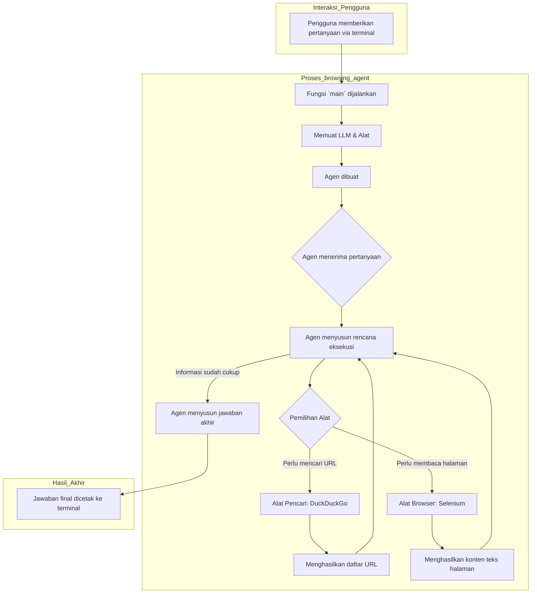

# Agen Browsing Web dengan LangChain

Proyek ini adalah implementasi agen browsing web sederhana yang dibuat menggunakan framework LangChain dan terhubung ke Azure OpenAI. Agen ini dapat mencari informasi di web dan membaca konten halaman untuk menjawab pertanyaan pengguna.

## Fitur Utama

- **Integrasi LLM**: Menggunakan `AzureChatOpenAI` sebagai "otak" untuk kemampuan berpikir dan mengambil keputusan.
- **Pencarian Web**: Memanfaatkan `DuckDuckGoSearchRun` untuk menemukan alamat URL yang relevan dengan pertanyaan pengguna.
- **Membaca Halaman Web**: Menggunakan `Selenium` dan `webdriver-manager` untuk membuka browser (tanpa antarmuka/headless), mengambil teks dari halaman web, dan memberikannya kepada agen.
- **Agen Cerdas Berbasis Alat**: Dibangun menggunakan fungsi `create_agent` modern dari LangChain. Agen ini diberikan sebuah *system prompt* (instruksi) dan satu set alat, yang memungkinkannya untuk secara mandiri menyusun rencana dan menggunakan alat yang tersedia.
- **Struktur Kode Modular**: Kode diorganisir ke dalam fungsi-fungsi yang jelas (`load_llm`, `define_agent`, `run_agent`) di bawah satu titik masuk `main()`, yang meningkatkan keterbacaan dan pemeliharaan.

## Cara Kerja

1.  Pengguna memberikan sebuah pertanyaan melalui terminal (contoh: "Siapa Jimmy Page? Apa bandnya yang paling terkenal?").
2.  Berdasarkan instruksi dan pertanyaan, agen akan menyusun rencana. Biasanya, ia akan menggunakan **Alat Pencari** (DuckDuckGo) terlebih dahulu untuk menemukan halaman web yang relevan.
3.  Dari hasil pencarian, agen akan memilih URL yang paling menjanjikan dan menggunakan **Alat Browser Web** (Selenium) untuk mengunjungi halaman tersebut.
4.  Alat browser akan menyalin teks dari konten halaman dan mengembalikannya ke agen.
5.  Agen menganalisis teks tersebut. Jika informasinya cukup untuk menjawab pertanyaan, agen akan menyusun jawaban akhir.
6.  Jika belum cukup, agen akan mengulangi prosesnya (misalnya, mencari kata kunci lain atau membuka halaman lain) sampai yakin bisa menjawab.
7.  Seluruh riwayat interaksi (termasuk pemanggilan alat) akan dikembalikan oleh agen.

## Diagram Alur Kerja

Berikut adalah diagram yang menggambarkan alur kerja agen dari awal hingga akhir:


## Instalasi & Pengaturan

1.  **Clone Repositori (jika Anda belum melakukannya):**
    ```bash
    git clone https://github.com/GigasTaufan/browsing_agent.git
    cd browsing_agent
    ```

2.  **Install semua library yang dibutuhkan:**
    Pastikan Anda sudah menginstall Python 3.8+. Disarankan untuk menggunakan virtual environment.
    ```bash
    pip install -r requirements.txt
    ```

3.  **Konfigurasi Variabel Lingkungan:**
    Agen ini memerlukan kredensial untuk Azure OpenAI.
    - Buat salinan dari file `.env.example` menjadi `.env`:
      ```
      copy .env.example .env
      ```
    - Buka file `.env` dan isi detail Azure OpenAI Anda:
      ```dotenv
      # Azure OpenAI
      AZURE_OPENAI_ENDPOINT="ENDPOINT_AZURE_OPENAI_ANDA"
      AZURE_OPENAI_API_KEY="API_KEY_AZURE_OPENAI_ANDA"
      AZURE_OPENAI_DEPLOYMENT_NAME="NAMA_DEPLOYMENT_ANDA"
      AZURE_OPENAI_PREVIEW_API_VERSION="2024-02-15-preview"
      ```

## Cara Menjalankan

Untuk menjalankan agen, cukup eksekusi script Python-nya:

```bash
python browsing_agent.py
```

Script akan secara otomatis:
1.  Memuat variabel lingkungan dari file `.env`.
2.  Menyiapkan LLM, semua alat, dan agen.
3.  **Meminta Anda untuk memasukkan pertanyaan** di terminal.
4.  Menjalankan agen dan mencetak jawaban akhirnya di terminal setelah selesai.