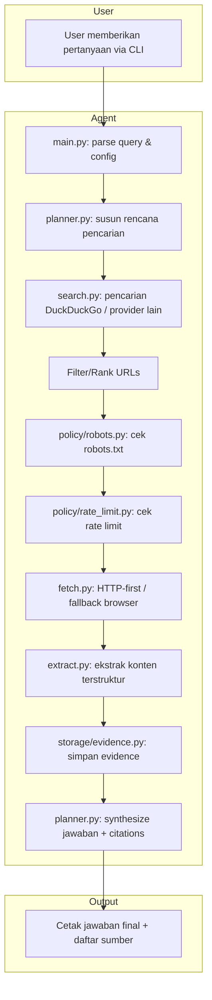

# Product Requirements Document (PRD) — Browsing Agent

**Versi**: 1.0-draft  
**Tanggal**: 2026-05-26  
**Status**: MVP → General Browsing Information Agent (11 Fase)  
**Bahasa**: Indonesia  

---

## 1. Executive Summary

### 1.1 Visi
Membangun agen browsing web yang aman, modular, dan legal-compliant untuk menjawab pertanyaan umum pengguna dengan menyediakan jawaban yang akurat, terverifikasi, dan disertai sumber.

### 1.2 Tujuan
- Mengupgrade aplikasi browsing agent dari **MVP** menjadi **general browsing information agent** yang dapat diandalkan.
- Memastikan setiap jawaban yang dihasilkan mencantumkan sumber (citations).
- Menjaga kepatuhan terhadap kebijakan crawling yang aman (`robots.txt`, rate limit, transparent User-Agent).
- Menyediakan arsitektur yang modular sehingga mudah di-maintain dan di-extend.

### 1.3 Ruang Lingkup
| Termasuk | Tidak Termasuk |
|----------|----------------|
| Pencarian web (DuckDuckGo) + browsing halaman | Stealth, proxy rotation, fingerprint spoofing |
| Extract konten halaman web | CAPTCHA bypass |
| Citation/sumber jawaban | Paywall bypass |
| CLI interaktif + mode argumen | Login automation |
| robots.txt & rate limit compliance | Personal data harvesting |

---

## 2. Current State (v1.0)

Aplikasi saat ini telah berkembang dari MVP menjadi **v1.0** dengan arsitektur modular. Semua keterbatasan MVP telah diatasi.

| Aspek | Deskripsi |
|-------|-----------|
| **Entry Point** | `main.py` (modular) |
| **LLM** | AzureChatOpenAI (`gpt-4o-mini` default) |
| **Search** | DuckDuckGo (`DuckDuckGoSearchResults`) dengan backend retry (`lite` → `auto`) |
| **Browser** | Selenium headless Chrome sebagai fallback; HTTP-first via `httpx` |
| **Tools** | `search_tool`, `browse_tool` |
| **Extraction** | `trafilatura` primary, `BeautifulSoup` fallback — terstruktur (title, headings, text, links) |
| **Tool Limit** | Per-run state (`AgentRunState`): counter reset setiap query |
| **CLI** | Mode argumen + mode interaktif + `--verbose` flag |
| **Tests** | 5 test files dengan `pytest` |
| **Config** | Terpusat di `config.py` + `.env` |
| **Safe Crawling** | `robots.txt`, User-Agent transparan, rate limit per domain, guardrails |
| **Evidence** | Structured `EvidenceStore` dengan SHA256 dedup + citations di jawaban final |

---

## 3. Target State (v1.0)

Hasil akhir setelah 11 fase upgrade:

### 3.1 Arsitektur Modular
```
browsing_agent/
├── main.py              # Entry point CLI
├── config.py            # Environment, settings, constants
├── agent/
│   └── planner.py       # Logika perencanaan & orkestrasi agen
├── tools/
│   ├── search.py        # Pluggable search providers (DuckDuckGo, dll)
│   ├── fetch.py         # HTTP-first fetcher + fallback browser
│   └── extract.py       # Content extraction (title, headings, text, links)
├── policy/
│   ├── robots.py        # robots.txt checker
│   └── rate_limit.py    # Rate limiter per domain
├── storage/
│   └── evidence.py      # Structured evidence log + deduplication
└── tests/               # Unit tests (pytest)
```

### 3.2 Fitur Utama v1.0
| Fitur | Deskripsi |
|-------|-----------|
| **HTTP-first Fetching** | `httpx` sebagai default, Selenium/Playwright fallback untuk JS-heavy pages. |
| **Content Extraction** | Menghasilkan: title, canonical URL, main text, headings, links, `fetched_at`, `status_code`. |
| **Chunking** | Memotong halaman panjang secara terstruktur, bukan truncate mentah. |
| **Evidence & Citations** | Setiap sumber yang di-fetch disimpan secara terstruktur; jawaban final mencantumkan URL sumber. |
| **Search Ranking** | Filter & rank URL berdasarkan relevansi, freshness, source quality, deduplication. |
| **Safe Crawling** | Cek `robots.txt`, transparent User-Agent, per-domain rate limit, stop pada 403/429/CAPTCHA. |
| **Tool Execution Limits** | Counter reset per query; batas maksimum tool calls & URLs per query. |
| **CLI Improvement** | Mode argumen: `python main.py "your question" --verbose`; output sumber di akhir. |
| **Testing** | Unit test untuk robots checker, rate limiter, URL normalization, extractor, tool-call limit. |

---

## 4. Functional Requirements

### FR-1: Pencarian Web
- **FR-1.1**: Agen harus dapat melakukan pencarian web menggunakan DuckDuckGo sebagai default.
- **FR-1.2**: Arsitektur harus mendukung penambahan search provider lain (Google Custom Search, Brave Search) tanpa mengubah kode inti.
- **FR-1.3**: Hasil pencarian harus di-rank berdasarkan relevansi, freshness, dan kualitas sumber.
- **FR-1.4**: Deduplikasi URL berdasarkan canonical URL / content hash.

### FR-2: Fetching Halaman Web
- **FR-2.1**: Fetching default menggunakan HTTP (`httpx`) dengan timeout, retry, dan exponential backoff.
- **FR-2.2**: Selenium/Playwright digunakan hanya sebagai fallback untuk halaman JS-heavy.
- **FR-2.3**: Browser session harus di-reuse (tidak launch baru per URL).
- **FR-2.4**: Skip non-HTML content kecuali diminta secara eksplisit.
- **FR-2.5**: Content-Type harus diperiksa sebelum parsing.

### FR-3: Ekstraksi Konten
- **FR-3.1**: Setiap halaman yang di-fetch harus menghasilkan struktur data berisi:
  - `title`
  - `canonical_url`
  - `main_text`
  - `headings`
  - `links`
  - `fetched_at`
  - `status_code`
- **FR-3.2**: Ekstraksi menggunakan library Readability/trafilatura/BeautifulSoup (bukan `body.text[:1500]`).
- **FR-3.3**: Halaman panjang harus di-chunk secara terstruktur, bukan dipotong mentah.

### FR-4: Evidence & Citations
- **FR-4.1**: Setiap sumber yang di-fetch disimpan sebagai structured evidence:
  - `url`, `title`, `snippet`, `fetched_at`, `text_chunks`
- **FR-4.2**: Jawaban final harus mencantumkan sumber URL.
- **FR-4.3**: Deduplikasi berdasarkan canonical URL dan content hash.
- **FR-4.4**: Prefer multiple sources untuk jawaban faktual.

### FR-5: Safe Crawling Policy
- **FR-5.1**: Cek `robots.txt` menggunakan `urllib.robotparser` sebelum fetch.
- **FR-5.2**: Gunakan transparent User-Agent:
  `GigasBrowsingAgent/0.1 (+https://github.com/GigasTaufan/browsing_agent; contact: gigastaufan@gmail.com)`
- **FR-5.3**: Implementasi rate limiter per domain.
- **FR-5.4**: Stop atau backoff ketika menerima HTTP 403, 429, halaman CAPTCHA-like, atau robots disallow.
- **FR-5.5**: Gunakan guardrails untuk menolak scraping ilegal, login/paywall bypass, dan personal data harvesting.

### FR-6: Tool Execution Control
- **FR-6.1**: Tool-call counter harus di-reset per user query.
- **FR-6.2**: Ganti global counter dengan per-run state.
- **FR-6.3**: Pastikan `max_tool_calls` benar-benar menghentikan eksekusi.
- **FR-6.4**: Tambah batasan `max_urls_per_query` dan `max_fetch_depth`.

### FR-7: Agent Behavior
- **FR-7.1**: Agen harus mengikuti alur:
  ```
  User query → plan search terms → search → filter/rank URLs → policy check → fetch → extract → synthesize answer with citations
  ```
- **FR-7.2**: Agen harus berhenti ketika informasi sudah cukup atau terkena blokir.

### FR-8: CLI
- **FR-8.1**: Pertahankan CLI interaktif (`input()` loop) sebagai mode default.
- **FR-8.2**: Tambah mode argumen: `python main.py "your question" --verbose`.
- **FR-8.3**: Cetak daftar sumber yang digunakan di akhir jawaban.

---

## 5. Non-Functional Requirements

### NFR-1: Keamanan
- **NFR-1.1**: Kredensial Azure OpenAI dan search provider disimpan di `.env` (tidak di-commit).
- **NFR-1.2**: Tidak ada logging kredensial ke stdout/file.
- **NFR-1.3**: Input pengguna tidak langsung dieksekusi sebagai kode.

### NFR-2: Legal Compliance
- **NFR-2.1**: Tidak implementasi proxy rotation, fingerprint spoofing, CAPTCHA bypass, atau paywall bypass.
- **NFR-2.2**: Patuh `robots.txt` dan kebijakan rate limit.
- **NFR-2.3**: User-Agent transparan yang dapat diidentifikasi.

### NFR-3: Maintainability
- **NFR-3.1**: Kode menggunakan type hints dan Pydantic models / dataclasses.
- **NFR-3.2**: Fungsi-fungsi memiliki tanggung jawab tunggal.
- **NFR-3.3**: Komentar, docstring, dan UI string menggunakan Bahasa Indonesia.

### NFR-4: Testing
- **NFR-4.1**: Unit test untuk: robots checker, rate limiter, URL normalization, extractor, tool-call limit reset.
- **NFR-4.2**: Mocked fetch tests, tidak mengakses website nyata di CI.

### NFR-5: Performance
- **NFR-5.1**: Browser session di-reuse untuk mengurangi overhead.
- **NFR-5.2**: HTTP-first fetching mengurangi latency untuk halaman statis.

---

## 6. Architecture Overview

### 6.1 Diagram Alur Kerja v1.0


### 6.2 Modul & Tanggung Jawab

| Modul | Tanggung Jawab |
|-------|----------------|
| `main.py` | Entry point, inisialisasi, CLI loop/argparse. |
| `config.py` | Load `.env`, settings (MAX_TOOL_CALLS, USER_AGENT, dll), validasi konfigurasi. |
| `agent/planner.py` | Orkestrasi alur agen, state management per-query, synthesize jawaban. |
| `tools/search.py` | Interface search provider, implementasi DuckDuckGo, ranking hasil. |
| `tools/fetch.py` | HTTP fetcher (`httpx`), browser fallback (Selenium), session reuse, retry. |
| `tools/extract.py` | Parsing HTML, ekstraksi terstruktur, chunking. |
| `policy/robots.py` | Cek `robots.txt`, parsing kebijakan situs. |
| `policy/rate_limit.py` | Rate limiter per domain, backoff strategy. |
| `storage/evidence.py` | Structured evidence store, deduplication, retrieval untuk citations. |

---

## 7. Implementation Phases

Proyek dikerjakan dalam **11 fase** sesuai roadmap.

### Phase 1 — Refactor Structure
- **Goal**: Pecah monolith menjadi modul-modul terpisah.
- **Deliverables**:
  - Buat direktori: `agent/`, `tools/`, `policy/`, `storage/`, `tests/`.
  - Pindahkan logika ke file yang sesuai:
    - `browsing_agent_selenium.py` → `main.py`, `agent/planner.py`
    - `conf/tool_selenium.py` → `tools/search.py`, `tools/fetch.py`, `tools/extract.py`
  - Tambah `config.py` untuk settings.
- **Acceptance Criteria**:
  - Tidak ada logic botak di root selain `main.py`.
  - Import berfungsi tanpa circular dependency.

### Phase 2 — Fix Tool Execution Limits
- **Goal**: Perbaiki bug counter global.
- **Deliverables**:
  - Ganti global counter dengan per-run state (dataclass / dict).
  - Reset counter setiap kali `run_agent()` dipanggil.
  - Pastikan eksekusi berhenti saat `max_tool_calls` tercapai.
  - Tambahkan `max_urls_per_query` dan `max_fetch_depth`.
- **Acceptance Criteria**:
  - Tool-call counter = 0 untuk setiap query baru.
  - Agent berhenti ketika limit tercapai.

### Phase 3 — Safe Crawling Policy
- **Goal**: Tambahkan kebijakan crawling yang aman.
- **Deliverables**:
  - `policy/robots.py`: Cek `robots.txt` via `urllib.robotparser`.
  - `policy/rate_limit.py`: Rate limiter per domain (in-memory / simple dict).
  - User-Agent transparan.
  - Handling HTTP 403, 429, CAPTCHA-like pages.
- **Acceptance Criteria**:
  - robots.txt dicek sebelum setiap fetch.
  - Rate limit aktif per domain.
  - Tidak implementasi proxy rotation / spoofing.

### Phase 4 — Improve Fetching
- **Goal**: Optimasi fetching dengan HTTP-first strategy.
- **Deliverables**:
  - `tools/fetch.py`: Implementasi `httpx` dengan timeout, retry exponential backoff.
  - Reuse browser session (Selenium) untuk fallback.
  - Content-type filtering.
  - Skip non-HTML default.
- **Acceptance Criteria**:
  - Halaman statis di-fetch via `httpx`.
  - Browser hanya digunakan untuk JS-heavy pages.
  - Session browser di-reuse.

### Phase 5 — Improve Extraction
- **Goal**: Ekstraksi konten yang lebih baik dan terstruktur.
- **Deliverables**:
  - `tools/extract.py`: Gunakan BeautifulSoup / Readability / trafilatura.
  - Output berisi: title, canonical URL, main text, headings, links, fetched_at, status_code.
  - Implementasi chunking halaman panjang.
- **Acceptance Criteria**:
  - Output extraction terstruktur (Pydantic model).
  - Tidak ada truncate mentah 1500 karakter.
  - Chunking bekerja untuk halaman > threshold.

### Phase 6 — Evidence and Citations
- **Goal**: Setiap jawaban disertai sumber.
- **Deliverables**:
  - `storage/evidence.py`: Simpan setiap fetch sebagai evidence.
  - Field: url, title, snippet, fetched_at, text_chunks.
  - Deduplication: canonical URL + content hash.
  - Final answer mencantumkan sumber URL.
- **Acceptance Criteria**:
  - Evidence tersimpan untuk setiap fetch.
  - Jawaban final mencantumkan daftar sumber.
  - Sumber duplikat di-filter.

### Phase 7 — Search and Ranking
- **Goal**: Peningkatan kualitas pencarian.
- **Deliverables**:
  - Interface pluggable search provider:
    - DuckDuckGo (default)
    - Google Custom Search (planned)
    - Brave Search (planned)
  - Rank URLs: relevansi, freshness, source quality, deduplication.
- **Acceptance Criteria**:
  - Provider dapat diganti via config tanpa ubah kode utama.
  - Ranking bekerja sesuai kriteria.

### Phase 8 — Agent Behavior & Guardrails
- **Goal**: Alur agen yang konsisten dan aman.
- **Deliverables**:
  - Alur baku: query → plan → search → filter/rank → policy check → fetch → extract → synthesize + citations.
  - Guardrails:
    - Tolak illegal scraping.
    - No login/paywall bypass.
    - No personal data harvesting.
    - Stop ketika diblokir.
- **Acceptance Criteria**:
  - Agen mengikuti alur baku secara konsisten.
  - Guardrails aktif dan dapat diverifikasi.

### Phase 9 — Config and Environment
- **Goal**: Sentralisasi konfigurasi.
- **Deliverables**:
  - `config.py`: Load `.env`, validasi settings.
  - Update `.env.example`.
  - Pin dependency versions di `requirements.txt`.
  - Settings baru:
    - `MAX_TOOL_CALLS`
    - `MAX_URLS_PER_QUERY`
    - `REQUEST_TIMEOUT`
    - `RATE_LIMIT_PER_DOMAIN_SECONDS`
    - `USER_AGENT`
    - `BROWSER_FALLBACK_ENABLED`
- **Acceptance Criteria**:
  - Semua settings di-atas tersedia di `config.py`.
  - `.env.example` diperbarui.
  - Dependencies di-pin.

### Phase 10 — Tests
- **Goal**: Menambahkan test suite.
- **Deliverables**:
  - `tests/` dengan `pytest`.
  - Unit test untuk:
    - robots checker
    - rate limiter
    - URL normalization
    - extractor
    - tool-call limit reset
  - Mocked fetch tests (tidak mengakses website nyata).
- **Acceptance Criteria**:
  - Test suite dapat dijalankan dengan `pytest`.
  - Semua test lolos.

### Phase 11 — CLI Improvements
- **Goal**: Meningkatkan pengalaman CLI.
- **Deliverables**:
  - Mode argumen: `python main.py "your question"`.
  - Flag `--verbose`.
  - Output daftar sumber di akhir.
  - Pertahankan mode interaktif.
- **Acceptance Criteria**:
  - `python main.py "query"` menghasilkan jawaban.
  - `--verbose` menunjukkan log detail.
  - Mode interaktif tetap berfungsi.

---

## 8. User Stories / Use Cases

### US-1: Pengguna Umum
> Sebagai pengguna umum, saya ingin mengetik pertanyaan di terminal dan mendapat jawaban akurat dengan sumber, agar saya bisa mempercayai informasi tersebut.

**Skenario**:
1. Pengguna menjalankan: `python main.py "Siapa penemu telepon?"`
2. Agen mencari via DuckDuckGo.
3. Agen memilih URL terbaik, cek robots.txt, dan fetch.
4. Agen menyusun jawaban: "Penemu telepon adalah Alexander Graham Bell."
5. Agen mencantumkan sumber: `https://example.com/biography/bell`

### US-2: Pengguna Mode Verbose
> Sebagai pengguna teknis, saya ingin melihat proses yang dilakukan agen (search, fetch, policy check) agar saya bisa memahami dan debug jika terjadi masalah.

**Skenario**:
1. Pengguna menjalankan: `python main.py "query" --verbose`
2. Terminal menampilkan log tiap step: search terms, URLs yang di-rank, robots.txt status, fetch result, evidence stored.

### US-3: Developer Maintainer
> Sebagai developer, saya ingin menambahkan search provider baru tanpa mengubah kode inti, agar integrasi lebih mudah.

**Skenario**:
1. Developer membuat class baru yang mengimplementasikan interface `SearchProvider`.
2. Daftarkan di `config.py`.
3. Agen otomatis menggunakan provider baru tanpa ubah `planner.py`.

---

## 9. Dependencies & Tech Stack

### 9.1 Core Dependencies
| Library | Kegunaan |
|---------|----------|
| `python-dotenv` | Load variabel lingkungan dari `.env` |
| `langchain` | Framework LLM & agent |
| `langchain-openai` | Integrasi Azure OpenAI |
| `langchain-community` | Tools komunitas (DuckDuckGo) |
| `langchain-core` | Komponen inti LangChain |
| `langchainhub` | Hub prompts |

### 9.2 Web & Browser
| Library | Kegunaan |
|---------|----------|
| `httpx` | HTTP-first fetching (Phase 4) |
| `selenium` | Browser automation (fallback) |
| `webdriver-manager` | Manajemen ChromeDriver |

### 9.3 Parsing & Extraction
| Library | Kegunaan |
|---------|----------|
| `lxml` | Parsing HTML/XML |
| `beautifulsoup4` | Ekstraksi konten (Phase 5) |
| `readability-lxml` atau `trafilatura` | Ekstraksi artikel bersih (Phase 5) |

### 9.4 Data & Config
| Library | Kegunaan |
|---------|----------|
| `pydantic` | Validasi settings & models (Phase 1/9) |

### 9.5 Testing
| Library | Kegunaan |
|---------|----------|
| `pytest` | Test runner (Phase 10) |
| `pytest-mock` atau `unittest.mock` | Mocking fetch (Phase 10) |

### 9.6 Environment Variables
| Variable | Required | Default | Keterangan |
|----------|----------|---------|------------|
| `AZURE_OPENAI_ENDPOINT` | Wajib | — | Endpoint Azure OpenAI |
| `AZURE_OPENAI_API_KEY` | Wajib | — | API Key Azure OpenAI |
| `AZURE_OPENAI_DEPLOYMENT_NAME` | Opsional | `gpt-4o-mini` | Nama deployment |
| `AZURE_OPENAI_PREVIEW_API_VERSION` | Wajib | — | Versi API preview |
| `MAX_TOOL_CALLS` | Opsional | `5` | Batas pemanggilan tool per query |
| `MAX_URLS_PER_QUERY` | Opsional | `3` | Batas URL yang di-fetch per query |
| `REQUEST_TIMEOUT` | Opsional | `30` | Timeout request (detik) |
| `RATE_LIMIT_PER_DOMAIN_SECONDS` | Opsional | `1` | Delay antar request ke domain yang sama |
| `USER_AGENT` | Opsional | `BrowsingAgent/0.1` | User-Agent string |
| `BROWSER_FALLBACK_ENABLED` | Opsional | `true` | Aktifkan fallback browser |

---

## 10. Acceptance Criteria (Keseluruhan)

Aplikasi telah memenuhi semua acceptance criteria:

- [x] Agen dapat menjawab pertanyaan informasi umum menggunakan search + browsing.
- [x] Setiap jawaban mencantumkan sumber (URL).
- [x] `robots.txt` dicek sebelum setiap fetch.
- [x] Rate limiter aktif per domain.
- [x] Tool-call counter di-reset per user query.
- [x] Browser di-reuse atau hanya digunakan sebagai fallback.
- [x] Tidak ada stealth, proxy rotation, CAPTCHA bypass, atau paywall bypass.
- [x] CLI mendukung mode argumen dan mode interaktif.
- [x] Test suite lolos 100% (`pytest`).
- [x] Semua settings terpusat di `config.py` dan `.env`.

---

## 11. Risks & Constraints

### Risks
| Risiko | Mitigasi |
|--------|----------|
| DuckDuckGo mengubah format output | Abstraksi interface search provider (Phase 7). |
| Website blokir User-Agent agen | Gunakan User-Agent transparan dan patuh robots.txt; tidak bypass. |
| Selenium overhead tinggi | HTTP-first + reuse session (Phase 4). |
| LangChain breaking changes | Pin versions di `requirements.txt` (Phase 9). |

### Constraints
- Tidak boleh mengimplementasikan: proxy rotation, fingerprint spoofing, CAPTCHA bypass, paywall bypass.
- Tidak boleh melakukan personal data harvesting.
- Tidak boleh mengotomatisasi login.
- Semua kode harus menggunakan Bahasa Indonesia untuk komentar/docstring/UI.
