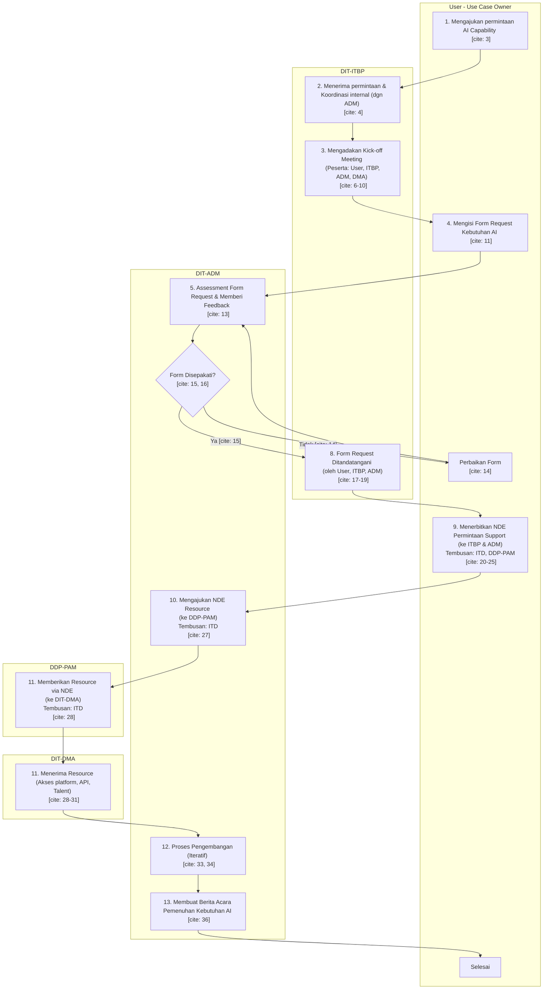

```mermaid
flowchart TD

    %% Mendefinisikan Swimlane (Aktor)
    subgraph User["User - Use Case Owner"]
        A["1. Mengajukan permintaan AI Capability <br> [cite: 3]"]
        E["4. Mengisi Form Request Kebutuhan AI <br> [cite: 11]"]
        I["Perbaikan Form <br> [cite: 14]"]
        K["9. Menerbitkan NDE Permintaan Support <br> (ke ITBP & ADM) <br> Tembusan: ITD, DDP-PAM <br> [cite: 20-25]"]
        Z["Selesai"]
    end

    subgraph DIT_ITBP["DIT-ITBP"]
        B["2. Menerima permintaan & Koordinasi internal (dgn ADM) <br> [cite: 4]"]
        C["3. Mengadakan Kick-off Meeting <br> (Peserta: User, ITBP, ADM, DMA) <br> [cite: 6-10]"]
        J["8. Form Request Ditandatangani <br> (oleh User, ITBP, ADM) <br> [cite: 17-19]"]
    end

    subgraph DIT_ADM["DIT-ADM"]
        F["5. Assessment Form Request & Memberi Feedback <br> [cite: 13]"]
        G{"Form Disepakati? <br> [cite: 15, 16]"}
        L["10. Mengajukan NDE Resource <br> (ke DDP-PAM) <br> Tembusan: ITD <br> [cite: 27]"]
        O["12. Proses Pengembangan (Iteratif) <br> [cite: 33, 34]"]
        P["13. Membuat Berita Acara Pemenuhan Kebutuhan AI <br> [cite: 36]"]
    end

    subgraph DDP_PAM["DDP-PAM"]
        M["11. Memberikan Resource via NDE <br> (ke DIT-DMA) <br> Tembusan: ITD <br> [cite: 28]"]
    end

    subgraph DIT_DMA["DIT-DMA"]
        N["11. Menerima Resource <br> (Akses platform, API, Talent) <br> [cite: 28-31]"]
    end

    %% Mendefinisikan Alur Proses
    A --> B
    B --> C
    C --> E
    E --> F
    F --> G
    G -- "Tidak [cite: 14]" --> I
    I --> F
    G -- "Ya [cite: 15]" --> J
    J --> K
    K --> L
    L --> M
    M --> N
    N --> O
    O --> P
    P --> Z

```